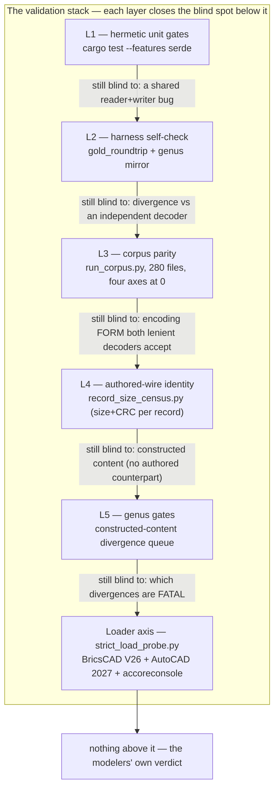
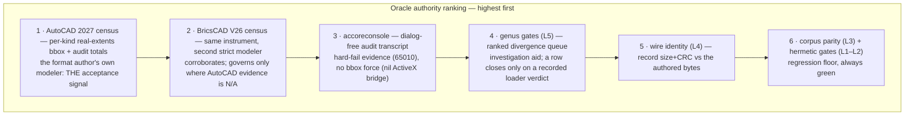
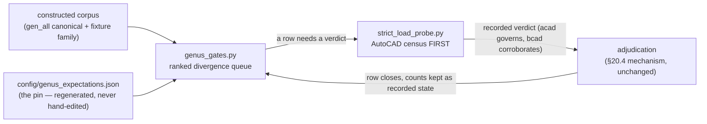
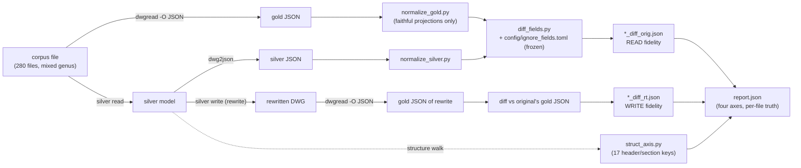
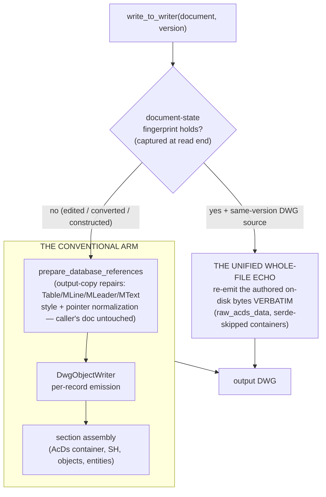
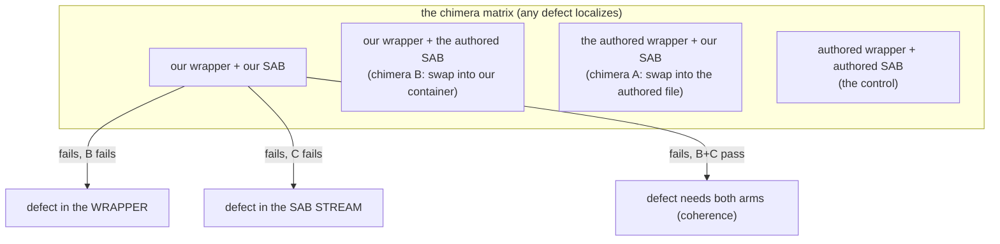
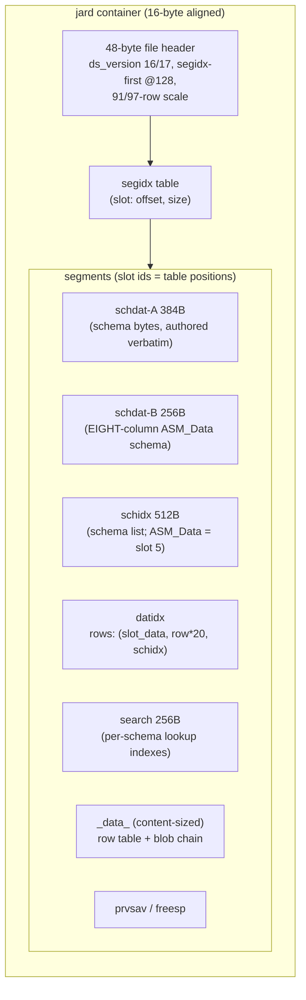
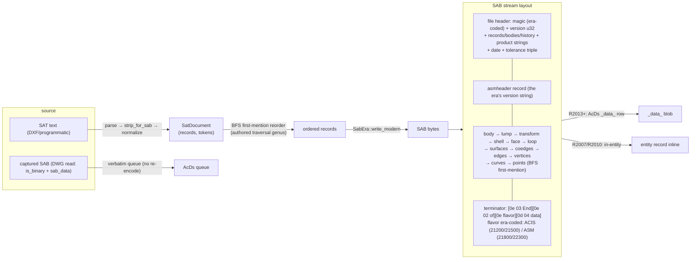
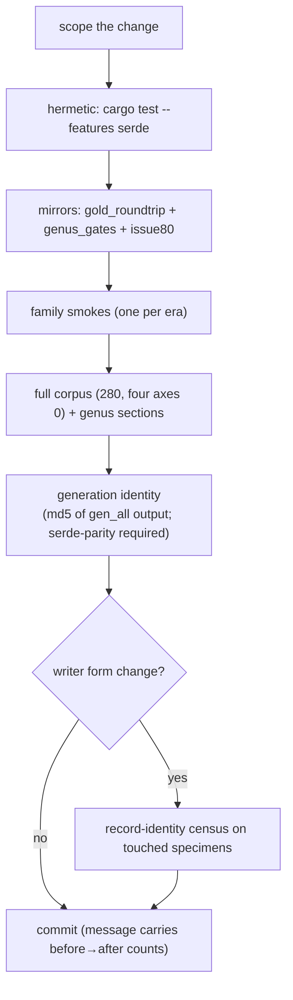

# ARCHITECTURE.md — the gold_harness design

The structural reference for the gold-vs-silver roundtrip harness: what each
component is, why it exists, and how the pieces connect. Campaign history and
queue state live in `../IMPLEMENTATION.md` (the plan) and `../NEXT_SESSION.md`
(the halt records); this file describes the *standing design* those records
operate on. Entry points: `../README.md` (workflow), `../AGENTS.md` (durable
rules).

---

## 1. What this harness is

Silver (`acadrust`) reads and writes native DWG. Three independent oracles
judge correctness: LibreDWG (a second, independent decoder — read-only), and
the two strict loaders, BricsCAD V26 and AutoCAD 2027, which *construct* the
document (regenerate B-reps, audit records) and reject byte-legal-but-
divergent encodings both decoders accept. No single oracle suffices, so the
harness is a stack of five validation layers plus a loader axis: each layer
closes the blind spot of the layer below it, and the loader axis closes the
blind spot all decoders share.

## 2. Glossary

| Term | Meaning |
|---|---|
| gold | LibreDWG's `dwgread` — the read-only reference decoder. Never edited. |
| silver | this crate (`acadrust`) — the implementation under test |
| the authored file / the authored bytes | a DWG written by AutoCAD or BricsCAD (a real modeler), as opposed to one silver constructed; the byte conventions it carries are the measured ground truth |
| genus | the measured invariants of the authored specimen family (e.g. "every authored AcDs container's `_data_` row 0 is the Model Layout thumbnail") |
| the pin | `config/genus_expectations.json` — the extracted genus expectations; regenerated by `genus_extract.py`, never hand-edited |
| echo arm | the writer's whole-file byte-copy path (unedited same-version roundtrip) |
| conventional arm | the writer's per-record re-encode path (edited / converted / constructed documents) |
| census | the probe's per-entity LISP walk: every entity's bounding box forced through the modeler, recorded by handle |
| verdict vocabulary | MODELED (real extents — the model constructed) / NULL-BOX (the null-extents sentinel: ±1e80 BricsCAD, ±1e20 AutoCAD — the B-rep did not construct) / NO-SOLID (no solid census at all) / AUDIT-REPORT (core console: no bbox force, transcript is the evidence) / AMBIGUOUS (run cut short) |
| adjudication | the recorded strict-loader verdict that closes a genus-queue row (the §20.4 mechanism) |

## 3. The validation stack — layers and blind spots

Each layer catches what the ones below it cannot. The diagram reads upward:
the arrow label is the blind spot the upper layer eliminates.



| Layer | Instrument | Blind spot it eliminates | Still blind to |
|---|---|---|---|
| L1 | `cargo test --features serde` | model/retention regressions | a bug shared by reader and writer |
| L2 | `gold_roundtrip` + `genus_gates` cargo mirror | harness drift; storage-only field leaks | divergence vs an independent decoder |
| L3 | `run_corpus.py` (280 files, 4 axes) | field-level reader/writer divergence vs gold | encoding *form* both lenient decoders accept; constructed content |
| L4 | `record_size_census.py` | writer form defects vs the authored wire | constructed content; strict-consumer acceptance |
| L5 | `genus_gates.py` vs the pin | constructed-content drift vs specimen-family invariants | which divergence is fatal — it ranks, never decides |
| Loader axis | `strict_load_probe.py` | construction/audit failures no decoder can see | nothing — top of the stack; the AutoCAD census is final |

## 4. Oracle authority ranking

When signals disagree, the higher-ranked oracle wins:



The ranking applies in two regimes, and the distinction is load-bearing:

> **Regression floor (authored content):** L1–L4 zeros — never regress;
> census-blind defect classes live here. **Acceptance apex (constructed
> content):** the loader axis, ranked AutoCAD census > BricsCAD census > core
> transcript; the genus gates rank the work toward it and decide nothing.

The ranking does not demote corpus parity: the census cannot see a
field-level parity diff or a record-form divergence on an authored file at
all — those defect classes exist only under L3/L4, whose zeros stay
non-negotiable.

### 4.1 The adjudication rule

A genus-queue row closes only on a recorded strict-loader verdict (the
existing §20.4 rule, unchanged). The ranking adds the tie-break: where both
loaders were exercised, the AutoCAD census verdict governs; BricsCAD
corroborates. Already-adjudicated rows stand — every one was subsequently
confirmed MODELED on both loaders (2026-09-30 record, IMPLEMENTATION.md §20).

### 4.2 The genus gates repositioned

The genus gates are an investigation aid feeding the loader axis, not a
verdict:



## 5. The corpus pipeline (L3)

`run_corpus.py` walks every corpus file through a read → diff → rewrite →
diff cycle. The differ (`diff_fields.py` + `ignore_fields.toml`) is frozen
during the fix loop: fixes belong in the codec, never in the differ.



Design invariants:

- **Normalizers are faithful projections, never data-hiding.** A normalizer
  may re-shape a value for comparison (e.g. pop writer-side codec channels
  that have no gold counterpart) but may not delete a real semantic
  difference. Every pop is loop-universal and documented.
- **`per_file` is truth; by-type tables truncate.** Corpus counts are
  stem-collision inflated (280 files → 196 unique stems) — use them for
  ranking only.
- **Header data is out of scope** (compared laxly); only the `OBJECTS` array
  is diffed exactly.
- **The four axes**: read fidelity, write fidelity, read structure key-gap,
  write structure key-gap — all held at 0.

The corpus is mixed-genus on purpose (ODA FileConverter stamps, AutoCAD
stamps, unmarked pre-R2004): wire conventions are content- and
generation-class facts, so byte attribution keys on a specimen's stamp and
content class, never on "which writer said so".

## 6. The write path (what L4 byte-compares)

Silver's DWG writer has two arms, chosen at the write entry:



- **The echo** is a byte-copy gated on a full-content hash: for an unedited
  same-version roundtrip the writer is a copier. The fingerprint
  (`document_state_fingerprint`) hashes the semantic inventory, the ten table
  control handles, and the retained metadata models; wire-only captures are
  excluded so codec-channel bookkeeping never blocks the echo.
- **The conventional arm** serves every other case. Its record emission is
  held to record identity: on every surveyed era specimen the rewrite's
  records match the authored ones on size + CRC-16 (`record_size_census.py`),
  with byte-passthrough replay for classes whose typed re-encode drifts (the
  520/528/529 wire-capture classes, DATATABLE raw passthrough, pre-2007 MText
  wire text).
- **The output-copy repairs** fix *invalid authored states* (a null MLeader
  style pointer, a corrupt MText attachment repeat) only in the write's
  copy — the caller's document stays untouched, and authored captures that
  already carry valid values pass through verbatim.

## 7. The loader axis (acceptance)

### 7.1 strict_load_probe.py

Drives the real modelers headless (`/b <script>`) over the constructed corpus
plus authored controls, and records the evidence a verdict needs:

```mermaid
sequenceDiagram
    participant P as probe (python)
    participant L as loader (AutoCAD / BricsCAD / core)
    participant D as staged copy
    P->>D: copy fixture to Windows-visible staging (per-run copy; suffix-keyed names)
    P->>L: launch /b script (WorkingDirectory pinned)
    L->>L: LOGFILEON → OPEN → LISP census (LOGSEC: every section flushed to disk)
    Note over L: per-kind census: all 29 kinds,<br/>trapped bbox force per entity<br/>(real extents = constructed; ±1e20/±1e80 = null box)
    L->>L: AUDIT (dbmod pre/post) → re-census
    L->>L: LOGFILEOFF → QUIT _N (saves the staged copy)
    L-->>P: result file (LOGSEC lines survive any kill)
    P->>P: harvest {run}_audit.log verbatim (the loader's own words)
    P->>P: classify: MODELED / NULL-BOX / NO-SOLID / AUDIT-REPORT / AMBIGUOUS
```

Guardrails baked into the instrument:

- **Launch-time LISP assertions** — every generated `.scr` must parenthesize
  to depth 0 (the one-paren-short stall class), written `encoding="ascii"`
  (a UTF-8 em-dash would reach the loader's ANSI codepage as a curly quote).
- **Bounded launches** — a missing result is AMBIGUOUS, never clean; stray
  loader processes are killed by PID, never by name (`acad.exe` is shared
  with other Autodesk sessions).
- **The audit reports are first-class evidence** — the modeler's own failure
  text ("Data stream is empty", "LeaderStyle Id is Null", "Modeling Operation
  Error: 65010") names the defect class before any byte-level investigation
  starts.
- **The core console** (`accoreconsole.exe`) is the dialog-free channel: its
  stdout transcript is the evidence (its ActiveX bridge is nil, so no bbox
  force there — verdicts read AUDIT-REPORT).
- `QUIT _N` **saves the staged copy**, so an audit's *repairs* are diffable
  against the pre-audit bytes — the empirical path that named the MText and
  MLeader defects field-exactly.
- **Launch order is AutoCAD first** (the authority ranking made executable):
  the default `--loader both` run probes each fixture under AutoCAD 2027
  before BricsCAD V26, so the acceptance signal prints first. Staging is
  per-run (`probe_one` re-copies the fixture; names carry the
  `__acad`/`__bcad` suffix), so AutoCAD's `QUIT _N` save cannot pollute the
  BricsCAD run.

### 7.2 entity_verification.py

The per-kind matrix: BUILD (public API constructs) / SILVER-READ / GOLD-READ
(census + ERROR lines) / REWRITE (conventional-arm survival) / MODELER (the
probe axis, AutoCAD census column first), all measured on the gen_all
canonical (one AC1032 document carrying all ~29 kinds). The README carries
the dated snapshot table.

### 7.3 The chimera instrument (examples/sab_swap.rs)

The blame-splitting design: swap one arm of a constructed-vs-authored pair
while holding the other fixed, and probe both chimeras plus controls.



The swaps are coherent — the SAB travels with its owning entity's 3BD anchor
(the modeler cross-checks the anchor against the SAB's actual geometry), so
the experiment never creates its own artifact.

### 7.4 The record-identity instruments

- `record_size_census.py` — handle-keyed (size + hdlsize + bitsize + CRC-16)
  record comparison for any pair on any era; `DWG_NO_ECHO=1 dwgrewrite`
  stages the conventional-arm rewrite to census against.
- `record_identity_survey.py` — the AC1021 corpus survey.
- `dump_section_bytes` / `ac21_token_diff` — the L4 pair-compare and the
  AC1021 compressed-stream differential.
- `restore_gap_diffs.py` — the SAB record-level pair diff (face-chain
  anchored isomorphism) for constructed-vs-authored stream study.

## 8. Appendix A — the AcDs container (R2013+ modeler data)

Constructed documents' 3DSOLID/REGION/BODY geometry lives in an
`AcDb:AcDsPrototype_1b` section — a `jard` container of named segments. The
layout (era-shared Form A, measured from the authored specimens):



The `_data_` record table is the multi-record heart (the 2026-09-30
row-locator design):

```
[48-byte segment header]
[20-byte row] × n:  (0x14, 1, owner_handle, 0, LOC)
                  LOC = cumulative chunk offset in the aligned blob area
[0x62 fill to 16-alignment]
[blob area]: [len u32][blob] × n   — row 0 = the Model Layout thumbnail PNG,
                                     rows 1..n = the SABs (datidx schidx 5)
```

The `search` segment carries per-schema lookup indexes in the authored
grammar — per block: `schema_namidx`, `(row<<32)` sorted keys,
`num_ididxs=0`, `unknown=1` (an authored constant), `zero`, then
`(handle, 1, row)` triples **row-synced with the keys**. The modeler resolves
handle→record through this table; a mis-synced search mispairs multi-record
geometry (entity A renders entity B's B-rep).

## 9. Appendix B — the SAB stream (the B-rep payload)

The ACIS/SAT model is serialized to SAB (binary SAT) at the write boundary:



The era profile (`SabEra`) pins the magic/version/triple per target era; the
product strings stay silver's own (the author-identity rule: never forge
Autodesk identity stamps). The terminator's segmented, era-coded form is
load-bearing: AutoCAD's modeler rejects the single-tag form at open-time
regeneration (the 65010), while BricsCAD tolerates both.

## 10. The zero-keeping workflow

Every change runs the gate in order; only commit when each step holds its
expected value:



Constructed-content changes are accepted by the AutoCAD census (README step
7b): the genus queue ranks the work, the census decides. The standing battery
values live in `NEXT_SESSION.md`'s verification gate; the identity history
there records every intended content change as a one-way chain.

## 11. Component map

| Component | Role | Layer |
|---|---|---|
| `harness/run_corpus.py` | the 280-file cycle → `report.json` | 3 |
| `harness/run_roundtrip.py` | single-family smoke | 3 |
| `harness/diff_fields.py` + `config/ignore_fields.toml` | the differ (**frozen**) | 3 |
| `harness/normalize_gold.py` / `harness/normalize_silver.py` | faithful comparison projections | 3 |
| `harness/struct_axis.py` | the 17 header/section keys | 3 |
| `analysis/record_size_census.py` | handle-keyed size+CRC identity, any era | 4 |
| `analysis/record_identity_survey.py` | the AC1021 survey | 4 |
| `src/bin/dump_section_bytes.rs` | record-framed raw byte dumps | 4 |
| `src/bin/ac21_token_diff.rs` | AC1021 compressed-stream differential | 4 |
| `src/bin/dwg2json.rs` | silver decode → JSON (serde-gated) | 3 |
| `src/bin/dwgrewrite.rs` | the conventional-arm staging writer | 4 |
| `genus/genus_extract.py` → `config/genus_expectations.json` | the expectation pin (fixtures-only) | 5 |
| `genus/genus_gates.py` | the constructed-corpus gate + ranked sections | 5 |
| `tests/genus_gates.rs` | the cargo mirror (fresh == pin) | 5 |
| `loaders/strict_load_probe.py` | the loader audit (AutoCAD / BricsCAD / core) | loader |
| `loaders/entity_verification.py` | the 29-kind × 5-axis matrix | loader |
| `analysis/restore_gap_diffs.py` | SAB record-level pair diff | loader |
| `harness/check_env.py` / `harness/bootstrap_oracle.sh` | environment + on-demand gold build | — |

## 12. Design principles (the load-bearing ones)

1. **Gold is read-only and never edited** — verify every field against its
   spec (`dwg.spec`/`dwg2.spec` + the common blocks) before changing code.
2. **The differ never changes to make a diff pass** — fixes belong in the
   codec, the dump, or the normalizers (as faithful projections).
3. **Attribution is measured, not assumed** — decode the authored bytes,
   survey the whole specimen family, and only then design the fix; the
   corpus is the authority where the spec undersides the runtime.
4. **Author identity is never forged** — product strings stay silver's own;
   format fields (magics, triples, terminators) follow the authored genus.
5. **Captured author data re-emits verbatim** — wire captures (SABs, wire
   text, raw passthrough classes) are replayed, not re-encoded; repairs fire
   only on degenerate values (nulls, zeros) an authored file never carries.
6. **Every verdict is mechanized or recorded as a manual procedure's
   evidence** — the probe's audit logs, the census counts, the identity
   chain: numbers a future session can re-verify, not prose it must trust.
7. **Authority is ranked** — within the acceptance regime the AutoCAD census
   outranks every lower signal; the L1–L4 zeros stay the non-negotiable
   floor for the defect classes the census cannot see.
